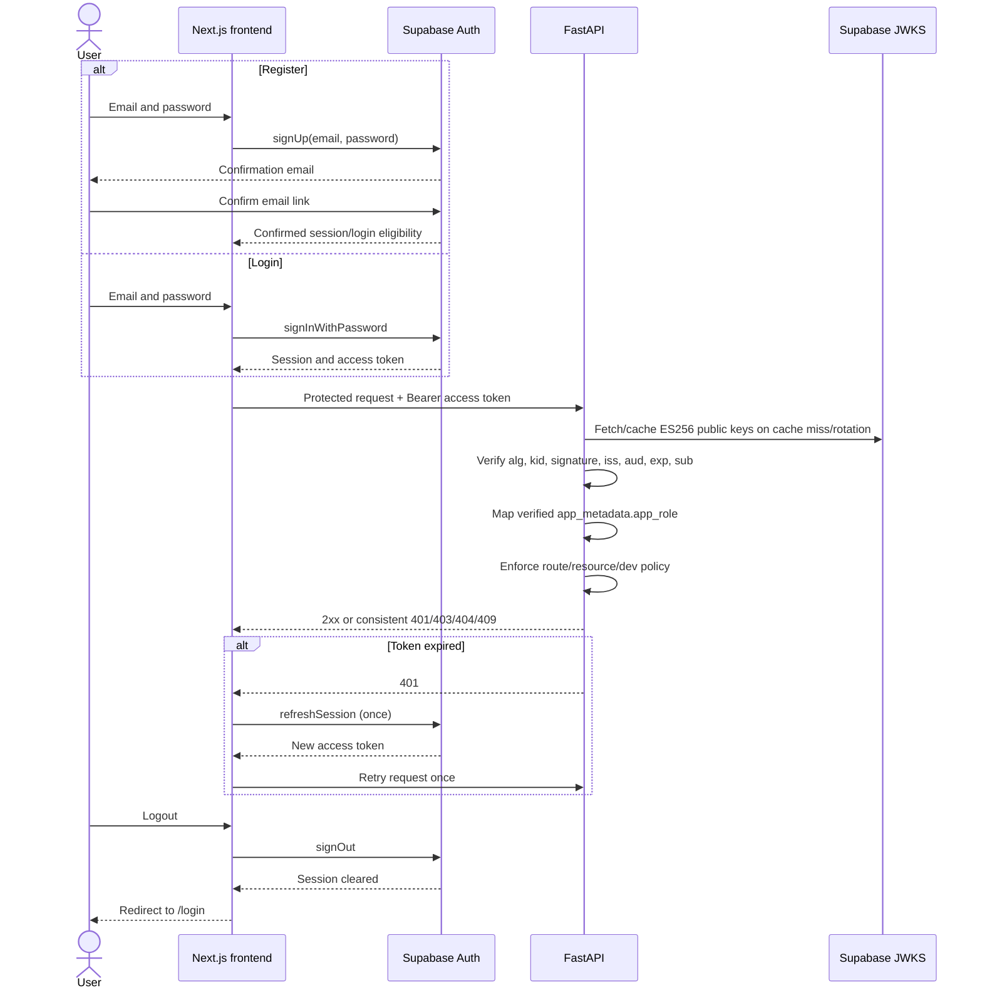
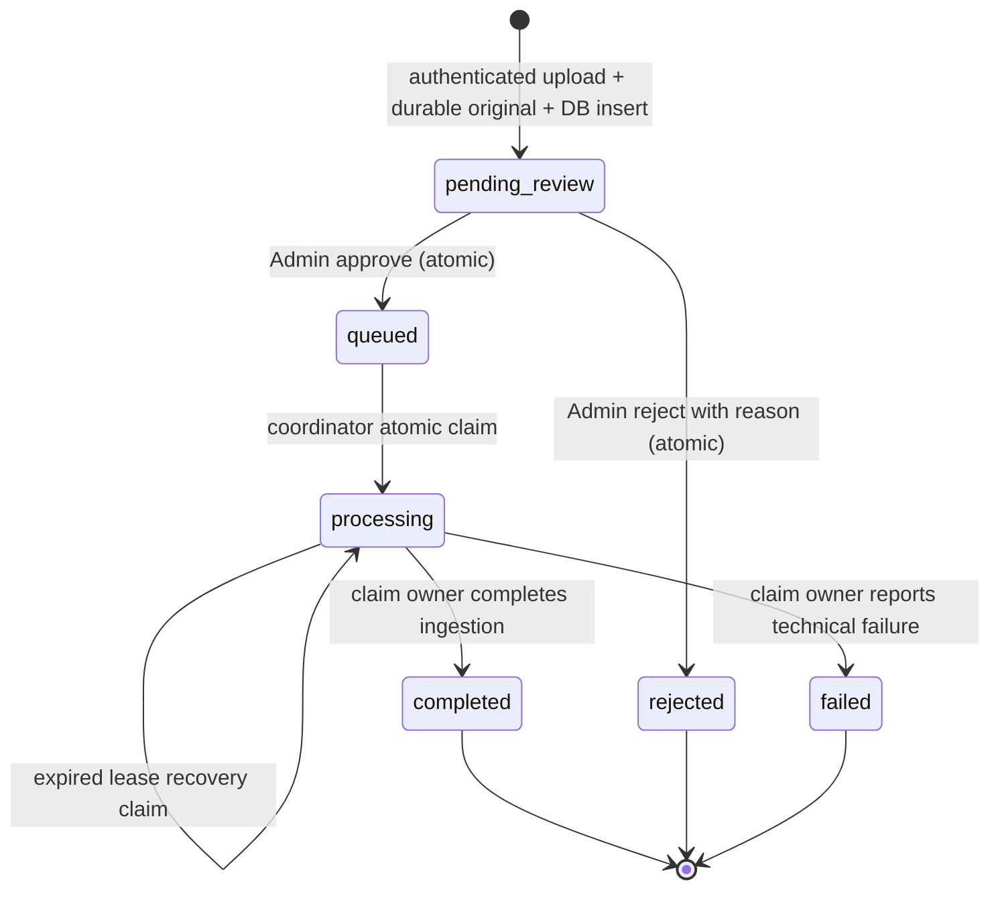

# Authentication, Authorization, and Document Moderation Technical Plan

> Planning date: 2026-08-20. This document is an implementation plan only. It does not authorize or contain application, migration, Supabase, dependency, deployment, CORS, worker-count, or frontend changes.

## 1. Executive Implementation Decision

Use Supabase Auth for email/password signup, login, session refresh, and logout. The Next.js frontend authenticates directly with Supabase and sends the Supabase access token to FastAPI as a Bearer token. FastAPI verifies ES256 tokens locally from the project's JWKS, derives a trusted `Principal`, and enforces the two roles `user` and `admin` at every application route.

Keep the approved global knowledge-base model and the existing parse/clean/OCR/chunk/embed/Qdrant/Supabase/BM25 pipeline. A new upload is stored privately and durably, then persisted as `pending_review`; it is not sent to ingestion. An Admin can list pending submissions, download the original, approve, or reject with a reason.

Keep exactly two Uvicorn workers. Supabase `documents` rows become the authoritative moderation state and durable ingestion work source. Approval atomically changes `pending_review` to `queued`. A small coordinator in each worker atomically claims one queued or lease-expired job through PostgreSQL, renews its lease, and dispatches it to that worker's existing process-local `TaskQueue`. Claim tokens, conditional finalization, deterministic Qdrant point IDs, and unique/upserted chunk IDs prevent duplicate logical completion and make crash recovery safe. Each process rebuilds its local BM25 index from authoritative chunks belonging to completed documents when a persisted corpus fingerprint changes.

No Redis, Celery, new database, new queue platform, worker-count change, RAG rewrite, per-user corpus, permission framework, or frontend rewrite is required.

Verified preconditions on 2026-08-20:

- the configured Supabase project exposes one asymmetric `ES256` signing key through JWKS;
- public email signup is enabled (`disable_signup=false`);
- email auto-confirm is disabled (`mailer_autoconfirm=false`), so registration requires email confirmation;
- the frontend repository is present at `D:\RAG\medical-rag-ui` and is Next.js 14 App Router, React 18, TypeScript, and Tailwind CSS.

## 2. Current-Code Findings That Affect Implementation

| Finding | Exact code | Implementation consequence |
| --- | --- | --- |
| FastAPI composition creates a separate service graph per process | `main.py::lifespan` constructs `DocumentStore`, `BM25Retriever`, `DocumentIngestionService`, and `TaskQueue` | Two Uvicorn workers have separate memory, sparse indexes, and queues; persistent coordination is mandatory. |
| Deployment is documented with two workers | `README.md` systemd `ExecStart ... --workers 2`; `.github/workflows/deploy.yml` restarts that service | The plan preserves two workers and must not rely on process-local uniqueness. |
| CORS is currently wildcard and credentials-enabled | `main.py` lines configuring `CORSMiddleware` | Replace with explicit environment-driven frontend origins during implementation; CORS remains unrelated to authorization. |
| No route has caller security | `src/api/rag_router.py`, `upload_router.py`, `eval_router.py`, and `dev_router.py` use dependencies only for services | Add centralized auth dependencies and apply an explicit policy to every route. `GET /health` remains public. |
| `dev` is untrusted request data | `src/api/schemas.py::RAGRequest.dev`; `RAGService` returns/persists traces when true | Check `user + dev=true` in the router before invoking RAG and before constructing `StreamingResponse`. |
| Upload immediately ingests | `src/api/upload_router.py::upload_document` saves locally/S3, creates `queued`, then calls `TaskQueue.enqueue_nowait` | Split submission from ingestion: upload writes `pending_review` and does not enqueue. |
| Upload storage silently falls back | `save_uploaded_file` always writes `uploads/`, optionally uploads to S3, and catches S3 errors | Deployed moderation mode must fail closed unless the private durable original is stored; local mode must be explicit and limited to development. |
| Ingestion requires a local path and deletes it | `DocumentIngestionService.ingest`; `finally` removes `file_path` | Materialize the durable original into a worker-unique temporary file after claim; delete only that temporary copy, never the durable original. |
| Current states do not include moderation | `src/models/document.py::DocumentStatus` is `uploaded`, `queued`, `processing`, `completed`, `failed` | Replace new-write behavior with the six-state machine in section 7; migrate legacy rows deliberately. |
| Document identity and audit fields are absent | `src/models/document.py::Document` | Add only fields needed for submitter authorization, review audit, and ingestion leasing. |
| Document reads are memory-only | `DocumentStore.get_document` and `list_documents` return process-local maps | Status, list, review, and worker claims must read Supabase; memory becomes a cache/runtime convenience only. |
| Critical persistence is best-effort | `SupabaseService.save_document`, `update_document_status`, and `save_chunks` catch errors and return false; `DocumentStore` does not require success | Critical moderation/claim/finalization operations must raise a typed persistence failure and fail closed. Trace logging may remain best-effort. |
| Startup hydration loads every chunk | `DocumentStore.load_from_supabase` calls `get_all_chunks` without completed-document filtering | BM25 initialization/sync must use only chunks whose parent document is `completed`. |
| Queue contents disappear on process death | `src/queue/task_queue.py` wraps an in-memory `asyncio.Queue` | Persist `queued` before local dispatch; coordinators rediscover queued and expired leased work. |
| A sync ingestion callable runs in the event loop | `TaskQueue._worker_loop` invokes a normal callable directly | Enqueue an async wrapper that runs the existing synchronous ingestion pipeline in `asyncio.to_thread`, leaving the event loop available for lease heartbeats. |
| BM25 is process-local and rebuilt only by the ingesting process | `BM25Retriever`; ingestion step 8 | Add startup and periodic corpus-fingerprint synchronization in both workers. |
| Qdrant is shared and point IDs are deterministic | `QdrantVectorStore.upsert` uses UUIDv5 of `chunk_id` | Retried ingestion overwrites the same vector points rather than adding duplicates. |
| Supabase chunks are already upserted | `SupabaseService.save_chunks` requests `resolution=merge-duplicates` | Verify/enforce a unique `chunk_id`; recovery can idempotently overwrite the same rows. |
| Retrieval is already global | Qdrant filters only by chunker type; BM25 indexes all loaded chunks | Do not add submitter/user filters after approval. |
| The complete RAG path is established | `RAGService` performs semantic + recursive + BM25, normalization, deduplication, reranking, LLM generation, citation parsing/validation, and evidence scoring | Add security around it; do not redesign it. |
| The frontend has one centralized API module | `medical-rag-ui/lib/api/client.ts` owns `/rag` and `/upload` fetches | Add Bearer attachment, one refresh/retry, errors, status/review, and authenticated stream handling in this module rather than pages. |
| The frontend is not currently streaming | `ChatThread.tsx` calls `askRag`; no `/rag/stream` client exists | Existing chat can remain non-streaming. If/when used, SSE must use authenticated `fetch` (not native `EventSource`, which cannot send this POST body and Bearer header). |
| Upload status is only an immediate success card | `DocumentUpload.tsx` and `UploadStatus.tsx` | Poll the protected status route and render all moderation/ingestion terminal states. |
| No frontend auth or testing package exists | `package.json`, current `app/`, and `components/` | Add the Supabase browser client, a small auth provider/guard, login/register pages, and focused frontend tests; do not change framework/layout architecture. |

No database DDL/migration directory is present in the backend repository, so the live `documents`/`document_chunks` constraints, indexes, and RLS policies must be inspected before writing the first tracked migration. That is a technical preflight, not an unresolved product decision.

## 3. Final Authentication Flow



The Supabase browser SDK owns persistent session storage and automatic refresh. FastAPI never receives passwords or refresh tokens and exposes no `/auth/*` proxy endpoints.

## 4. Backend Security Architecture

### Token validation

Add `PyJWT[crypto]` as the focused maintained JWT dependency. Implement one synchronous FastAPI security dependency so network/key lookup runs in FastAPI's threadpool rather than blocking the event loop.

Validation policy:

1. Extract exactly one `Authorization: Bearer <token>` credential with `HTTPBearer(auto_error=False)`.
2. Allow only configured asymmetric algorithms; initially `ES256`, confirmed by the project JWKS. Never accept an algorithm chosen only from the token header and never allow `none`.
3. Resolve `kid` through a cached `PyJWKClient` using the derived endpoint `<SUPABASE_URL>/auth/v1/.well-known/jwks.json`. Refresh keys on an unknown `kid`; fail closed if a valid key cannot be obtained.
4. Verify signature, exact issuer `<SUPABASE_URL>/auth/v1`, audience `authenticated`, and expiration. Require `iss`, `aud`, `exp`, and `sub`; validate `nbf`/`iat` when present with a small configured leeway.
5. Require top-level Supabase database claim `role == "authenticated"`; this is not the application role.
6. Parse `sub` as a UUID and expose it as the only trusted user ID. Treat email as optional display/audit context, never as identity.
7. Reject anonymous tokens because anonymous accounts are not part of the product.
8. Log only failure category/request correlation, never tokens or decoded sensitive claims.

If the project later rotates away from asymmetric signing to a shared secret, local JWKS verification must fail closed. The supported fallback is server-side `GET /auth/v1/user` with the publishable key, as documented by Supabase, not copying the signing secret into this app. No fallback is required now because ES256 was verified.

### Trusted principal and roles

Use a small immutable model:

```text
Principal(user_id: UUID, email: optional string, role: user|admin)
```

The application role comes only from verified `app_metadata.app_role`:

- exact string `admin` -> `admin`;
- missing, malformed, or any other value -> `user`;
- `user_metadata`, request bodies, headers, and frontend state never grant Admin.

New users need no role row or signup trigger. Manually bootstrap Admins through the trusted Supabase Dashboard/Admin API by setting `raw_app_meta_data.app_role=admin`; the user then refreshes/re-authenticates to receive a new signed token. Do not add role-management endpoints.

### FastAPI dependencies and route policy

- `get_current_principal`: valid authenticated `user` or `admin`, otherwise `401`.
- `require_admin`: calls/depends on the current principal and returns `403` unless role is `admin`.
- `enforce_rag_dev_policy(request, principal)`: explicit `dev=true` from a user returns `403` before `RAGService.query`, `query_stream`, or `StreamingResponse` creation.
- Resource authorization for document status is performed as a scoped database query: Admin by document ID; user by document ID **and** `submitted_by=principal.user_id`.

Endpoint policy:

| Endpoint | Policy |
| --- | --- |
| `GET /health` | Public |
| `POST /rag`, `POST /rag/stream`, `POST /upload` | Authenticated user or Admin; `dev=true` Admin only |
| `GET /documents/{id}/status` | Submitter or Admin; non-owner receives `404` |
| `GET /documents`, review download, approve, reject | Admin only |
| `POST /evaluate`, all `/dev/*` | Admin only |

FastAPI's generated documentation may remain public for the hackathon because it does not bypass route authorization. Making docs configurable/disabled in production is P1.

## 5. Two-Worker Correctness Strategy

### Actual two-process problems

With `--workers 2`, Python singleton scope stops at the process boundary:

- worker A cannot see a document inserted only into worker B's `DocumentStore` map;
- each `TaskQueue` can lose its items independently on crash/restart;
- both workers can observe the same persisted queued row and start it unless claiming is atomic;
- only the ingesting worker currently rebuilds its BM25 index;
- status requests can alternate between stale process-local answers;
- an approval request and the worker that later ingests it are not guaranteed to be the same process.

Authentication itself is stateless and works in both processes. Moderation, ingestion coordination, and sparse-index freshness require the following targeted changes.

### Authoritative document state

All upload creation, status lookup, Admin listing, moderation transitions, ingestion claims, lease renewal, and final state transitions use Supabase synchronously and fail closed. The in-memory `DocumentStore` document map may be retained as a mirror for compatibility but is never authoritative for an API decision or worker claim.

### Atomic approval and rejection

Use a conditional PostgREST update equivalent to:

```text
UPDATE documents
SET status = decision, reviewed_by = admin_id, reviewed_at = now(), ...
WHERE document_id = id AND status = 'pending_review'
RETURNING *
```

Only one concurrent approve/reject request receives a row. If zero rows are returned, perform a read: no document -> `404`; existing document in a non-pending state -> `409`. The local queue is not touched by the request. Approval's durable `queued` row is the work signal, so a crash after the HTTP commit cannot lose the job.

### Atomic work claims with recovery leases

Add one narrow PostgreSQL RPC, implemented in the tracked migration, to claim work transactionally:

1. Select the oldest `queued` row, or a `processing` row whose lease expired, using `FOR UPDATE SKIP LOCKED`.
2. Verify its durable original key is present.
3. Set `status=processing`, a new caller-supplied `ingestion_claim_id`, `ingestion_lease_expires_at`, and `updated_at`.
4. Return the claimed document in the same transaction.

Every worker starts an `IngestionCoordinator` during lifespan. It claims only when its local queue is idle, so each process has at most one ingestion in progress and the existing sequential queue semantics remain. Zero rows means sleep for the short poll interval. PostgreSQL row locking and the conditional update—not a Python lock—guarantee that two workers cannot successfully claim the same live job.

The coordinator enqueues an async wrapper on the existing `TaskQueue`. That wrapper:

- materializes the private original into a unique temporary path;
- runs synchronous ingestion with `asyncio.to_thread`;
- renews the database lease in a lightweight heartbeat task;
- checks claim ownership at stage boundaries and before artifact writes/finalization;
- finalizes `processing -> completed|failed` only where both document ID and claim ID still match;
- cleans only the temporary local file.

If heartbeat/claim ownership is lost, that attempt must not finalize the row and must stop before further external writes at the next safe stage boundary. A later worker may reclaim only after lease expiry. Lease duration must exceed normal heartbeat jitter; heartbeat interval must be materially shorter than the lease. A normal application shutdown stops claiming new work and lets the current task finish within the service stop timeout where possible; forced termination is recovered by expiry.

### Single logical ingestion and idempotency

The live lease permits one logical owner. Recovery after a dead owner can repeat physical work, so external writes must be idempotent:

- existing Qdrant point IDs are deterministic UUIDv5 values based on stable chunk IDs;
- enforce `document_chunks.chunk_id` uniqueness and upsert the same deterministic chunk IDs;
- clean/replace existing artifacts for the same document at recovery start if an incomplete prior attempt is detected, or overwrite them deterministically;
- conditional completion with the claim token prevents an expired former owner from marking a newer attempt complete/failed.

No public retry/reopen flow is added. A true processing exception marks `failed`; recovery applies only to expired `processing` leases caused by interruption. Partial-artifact compensation on a terminal failure is P1, but claim-safe idempotent recovery is P0.

### Restart recovery

There is no startup-only requeue window. Coordinators continuously poll the persistent rows, so they recover:

- `queued` documents that were approved before a crash or local enqueue;
- `queued` documents created while one worker was down;
- `processing` documents after their dead worker's lease expires.

The row and private original, not a lambda in memory, contain everything needed to resume. If the original is missing/unreadable, the claimed job is finalized `failed` with an internal diagnostic and safe user-facing status.

### Status correctness

`GET /documents/{id}/status` and Admin list/review calls always query Supabase. A database outage returns `503`; the API never substitutes a stale in-memory status. Therefore a request landing on either worker sees the same committed state.

### BM25 correctness

Qdrant is already shared, so dense retrieval sees deterministic upserts from either worker. BM25 remains deliberately process-local, but its corpus is derived from persistent completed chunks:

1. On startup, each worker loads only chunks joined to `documents.status=completed` and builds BM25.
2. Each worker runs a small `BM25SyncService` that polls a corpus fingerprint such as `(completed_document_count, max(completed.updated_at))`.
3. When the fingerprint changes, it fetches a consistent completed-chunk snapshot and atomically swaps/rebuilds that process's BM25 index.
4. The ingesting worker requests an immediate local refresh after successful completion; the other worker refreshes within the configured short interval.
5. On sync failure, retain the last valid index, log degraded sparse freshness, and retry; shared semantic/recursive Qdrant retrieval remains available.

Completed documents are immutable in P0, so the count plus latest completion update is sufficient to detect additions. If post-hackathon editing/deletion is introduced, replace this with a monotonic corpus revision.

This retains the current BM25 architecture and existing TaskQueue. Supabase/PostgreSQL already exists; its row locks, status rows, and RPC are the minimum coordination mechanism. No major architecture component is introduced.

## 6. Persistence and State Ownership

| State/data | Authority | Process-local role |
| --- | --- | --- |
| Supabase Auth users/sessions | Supabase Auth | Frontend SDK caches current browser session; backend keeps no session database. |
| Application role | Signed verified `app_metadata.app_role` | `Principal` exists for one request only. |
| Document metadata, submitter, review audit, lifecycle status | Supabase `documents` | Optional `DocumentStore` mirror only; never authorization/state authority. |
| Durable ingestion job | `documents.status`, claim ID, lease expiry | Each `TaskQueue` executes only a currently claimed job. |
| Original file | Private S3 in deployed mode; explicit local directory in dev only | Worker temporary copy used by parser/OCR and deleted afterward. |
| Chunk text/metadata | Supabase `document_chunks`, restricted to completed parents for BM25 | Each worker caches completed chunks inside its BM25 index. |
| Dense vectors | Shared Qdrant collection | Clients/services are process-local handles to shared data. |
| Sparse index | Derived from completed Supabase chunks | One BM25 instance per worker; rebuilt on corpus-fingerprint change. |
| Dev/evaluation traces | Existing Supabase tables | Existing best-effort trace behavior may remain, but endpoints become Admin-only. |

Critical document persistence must use the backend-only Supabase secret key and must not fall back to the publishable key. The frontend uses Supabase directly only for Auth; it never reads/writes application tables or storage directly.

## 7. Final Document State Machine



| From -> To | Trigger | Atomic requirement | Invalid behavior / multi-worker rule |
| --- | --- | --- | --- |
| none -> `pending_review` | Authenticated upload after durable storage succeeds | DB insert must succeed before `202`; compensate stored object if insert fails | No caller may supply submitter/status. No queue or ingestion call. |
| `pending_review` -> `queued` | Admin approve | Conditional update on current status | Duplicate/conflicting review returns `409`; exactly one request succeeds. |
| `pending_review` -> `rejected` | Admin reject with required reason | Conditional update on current status | Race with approval/double rejection returns `409`; delete original after commit, best effort and observable. |
| `queued` -> `processing` | Either worker's coordinator | Claim RPC with row lock/skip-locked, claim ID, lease | Only one worker receives the row. |
| expired `processing` -> `processing` | Recovery coordinator | Same RPC; only where lease is expired | New claim invalidates old claim; idempotent artifact rules apply. |
| `processing` -> `completed` | Current claim owner after all required writes | Conditional finalizer on status and claim ID | Stale owner cannot finalize. Clear lease/claim fields. |
| `processing` -> `failed` | Current claim owner on unrecoverable technical error/missing original | Conditional finalizer on status and claim ID | Stale owner cannot overwrite another attempt. |

All other externally requested transitions are invalid and return `409 Conflict`. `completed`, `rejected`, and `failed` are terminal for the hackathon. Correction/resubmission creates a new document ID. `uploaded` is legacy-only and is never written by new code.

## 8. Upload and Moderation Flow

```mermaid
sequenceDiagram
    actor U as Authenticated user
    participant API as FastAPI (either worker)
    participant S3 as Private S3
    participant DB as Supabase/PostgreSQL
    actor A as Admin
    participant C as Coordinators (two workers)
    participant Q as Claimed worker TaskQueue
    participant I as Existing ingestion pipeline
    participant KB as Qdrant + chunks + BM25 sync

    U->>API: POST /upload + Bearer + multipart file
    API->>API: Verify token/type/size; derive submitted_by
    API->>S3: Put private original under server-generated key
    S3-->>API: Durable success
    API->>DB: Insert pending_review
    DB-->>API: Committed row
    API-->>U: 202 pending_review
    Note over API,KB: No parse, OCR, chunk, embed, Qdrant, chunks, or BM25

    A->>API: GET /documents?status=pending_review
    A->>API: GET /documents/{id}/download
    API->>S3: Read private original
    API-->>A: Authenticated streamed download

    alt Approve
        A->>API: POST /documents/{id}/approve
        API->>DB: Conditional pending_review -> queued
        DB-->>API: Exactly one updated row
        API-->>A: 202 queued
        loop Persistent polling
            C->>DB: Atomic claim queued/expired lease
        end
        DB-->>Q: One worker receives processing claim
        Q->>S3: Materialize temporary original
        Q->>I: parse -> clean/OCR -> chunk -> embed
        I->>KB: Idempotent chunks + Qdrant writes
        I->>DB: Conditional claim finalization -> completed
        I->>KB: Local refresh; peer BM25 observes fingerprint
    else Reject
        A->>API: POST /documents/{id}/reject {reason}
        API->>DB: Conditional pending_review -> rejected
        DB-->>API: Committed rejection/audit
        API-->>A: 200 rejected
        API->>S3: Delete original best effort
    end
```

Rejection reason is required (trimmed, 1-500 characters). It gives the submitter an actionable status with little workflow cost. Rejected metadata and audit fields remain; the original is deleted after the rejection commits. Failure to delete is logged for operational cleanup and does not roll back rejection. Reopening/appeal is deferred.

Admin uploads follow the same review workflow. Self-approval is allowed for the hackathon because no separation-of-duties requirement was provided and forbidding it would add a third policy without improving two-role enforcement.

## 9. Final API Contract Changes

| Method | Route | Role | Request | Response | Key Errors | Purpose |
| --- | --- | --- | --- | --- | --- | --- |
| `GET` | `/health` | Public | None | Existing health shape | Existing `200` degraded/healthy behavior | Public liveness/health; no caller data. |
| `POST` | `/rag` | User/Admin | Existing `{query, dev?}` | Existing `RAGResponse` | `401` auth; `403` user with `dev=true`; existing `400/500/503` | Authenticated global RAG. |
| `POST` | `/rag/stream` | User/Admin | Existing `{query, dev?}` | Existing SSE events | Same as `/rag`; auth/dev failures occur before stream starts | Authenticated streaming RAG. |
| `POST` | `/upload` | User/Admin | Existing multipart `file`; no identity/status fields | `202` `{document_id, filename, file_type, status:"pending_review", message}` | `401`, `400`, `413`, framework `422`, `503` storage/DB | Create durable unindexed submission. |
| `GET` | `/documents/{document_id}/status` | Own submission/Admin | Path ID | `{document_id, filename, status, total_pages, rejection_reason?, failure_message?}` | `401`; `404` absent/non-owner; `503` DB | User-visible moderation/ingestion status. |
| `GET` | `/documents` | Admin | Optional `status`; optional bounded `limit`/`offset` if needed by UI | `{documents:[...]}` with metadata/audit | `401`, `403`, `422`, `503` | List/filter submissions; UI initially requests pending. |
| `GET` | `/documents/{document_id}/download` | Admin | Path ID | Stream with safe filename/content type | `401`, `403`, `404`, `409` not reviewable/original removed, `503` storage | Inspect original before decision. |
| `POST` | `/documents/{document_id}/approve` | Admin | No body | `202` `{document_id,status:"queued",reviewed_by,reviewed_at}` | `401`, `403`, `404`, `409`, `503` | Atomic approval; durable queue signal. |
| `POST` | `/documents/{document_id}/reject` | Admin | `{reason:string}` (1-500 trimmed) | `200` `{document_id,status:"rejected",rejection_reason,reviewed_by,reviewed_at}` | `401`, `403`, `404`, `409`, `422`, `503` | Atomic rejection and audit. |
| `POST` | `/evaluate` | Admin | Existing `EvaluateRequest` | Existing `EvaluateResponse` | `401`, `403`, existing errors | Protect expensive evaluation. |
| `GET` | `/dev/queries` | Admin | Existing `limit` query | Existing query summaries | `401`, `403`, existing `503` | Protect stored user queries. |
| `GET` | `/dev/queries/{query_id}/trace` | Admin | Existing path ID | Existing trace | `401`, `403`, existing `404/503` | Protect chunk text/traces. |
| `POST` | `/dev/queries/{query_id}/evaluate` | Admin | Existing path ID | Existing report | `401`, `403`, existing `404/503` | Protect LLM cost/dev operation. |

Do not add user-supplied submitter, reviewer, role, status, storage path, or claim fields to any request.

## 10. Database / Supabase Changes

### REQUIRED

| Change | Migration intent |
| --- | --- |
| `documents.submitted_by` | Nullable UUID for trusted legacy rows, required by application for new uploads; FK to `auth.users(id) ON DELETE SET NULL` if live schema permits. |
| `documents.status` allowed values | `pending_review`, `queued`, `processing`, `completed`, `rejected`, `failed`; temporarily account for legacy `uploaded` during migration only. |
| `documents.rejection_reason` | Nullable text with application length 1-500; populated only on rejection. |
| `documents.reviewed_by` | Nullable UUID FK to `auth.users(id) ON DELETE SET NULL`. |
| `documents.reviewed_at` | Nullable timezone-aware timestamp set on approve/reject. |
| `documents.updated_at` | Timezone-aware timestamp maintained on state/lease changes; needed for state observability and BM25 corpus fingerprint. |
| `documents.ingestion_claim_id` | Nullable UUID, set only while processing; fencing token for the current attempt. |
| `documents.ingestion_lease_expires_at` | Nullable timezone-aware timestamp, set/renewed while processing; restart recovery. |
| Status/review consistency constraints | Rejected requires a reason/reviewer/time; pending has no review fields; processing requires claim/lease; terminal/queued rows clear claim/lease. Keep constraints compatible with legacy backfill order. |
| Index `(status, upload_timestamp)` | Pending Admin list and oldest queued claim. |
| Index `(submitted_by, document_id)` | Scoped status lookup. |
| Unique `document_chunks.chunk_id` | Required for idempotent recovery upserts; inspect existing constraint before adding. |
| Claim/renew/finalize SQL functions | `SECURITY DEFINER` only if required, fixed `search_path`, revoke public execution, grant only to backend service role. Claim uses `FOR UPDATE SKIP LOCKED`; renew/finalize require claim ID. |
| RLS hardening | Enable RLS on application tables; no direct `anon`/`authenticated` policies for documents/chunks/dev/evaluation data. FastAPI's backend secret is authoritative. |
| Tracked migration location | Establish `supabase/migrations/<timestamp>_auth_moderation.sql`; inspect live DDL/RLS first because no migrations currently exist. |

The existing `upload_timestamp` is the submission time. Do not create a separate submissions table or queue-job table.

### OPTIONAL (P1)

- `rejected_object_deleted_at` or a cleanup-error marker if operational cleanup visibility proves necessary.
- `content_sha256` for duplicate warnings, not authorization.
- separate safe/public failure message if the single generic user message becomes insufficient.
- `ingestion_attempt_count` for operations/diagnostics.

### DEFER

- profiles, user-role, permission, policy-engine, or custom-claims tables;
- direct frontend table/storage access policies;
- ownership fields on Qdrant/chunks for retrieval filtering;
- queue-job/event/audit platform;
- document versions, reopen, appeal, retry API, sharing, or tenant models;
- monotonic corpus-revision table until completed documents can be edited/deleted.

### Legacy data migration

- Keep existing `completed` rows/vectors/chunks as trusted global knowledge; audit fields remain NULL to mean legacy/system seeded. Do not rebuild Qdrant.
- Keep existing `failed` rows failed.
- During a maintenance rollout after stopping ingestion, inspect every `uploaded`, `queued`, or `processing` row and its original/artifacts. Default unverified nonterminal rows to `pending_review` when a durable original exists; otherwise mark failed with an internal migration diagnostic. Do not automatically ingest them.
- Backfill `updated_at` from `upload_timestamp` where no better timestamp exists.
- Initialize claim/lease fields NULL.
- Build each worker's BM25 once from completed persisted chunks after migration; this is index hydration, not a RAG database rebuild.

## 11. Storage Strategy

Use the existing S3 integration as the deployed durable-original store, but make its mode explicit and fail closed.

1. **Upload:** validate existing extension/size rules, generate the document UUID and server-controlled key such as `documents/<document_id>/original.<ext>`, and put it in a private pre-provisioned bucket. Do not auto-create a bucket in the request path. Persist only the opaque key/URI after storage succeeds.
2. **DB failure after put:** attempt object deletion; return `503`; log an orphan-cleanup event if compensation fails.
3. **Review:** FastAPI verifies Admin and streams the private object with a sanitized `Content-Disposition` filename. This avoids public objects and avoids needing a Bearer token on a direct S3 navigation.
4. **Approval/processing:** the claiming worker downloads to a unique `tempfile` path, verifies the object is available, and passes the local path to existing parsers/OCR. The ingestion `finally` removes only the temp file.
5. **Rejection:** retain document metadata/reason/reviewer; delete the original after the database transition commits. Deletion failure is logged and retried operationally/P1, but rejection remains terminal.
6. **Completion:** retain the approved original privately for audit/reproducibility through the hackathon. Long-term retention is an open policy decision, not a blocker.
7. **Failure:** retain the approved original so operators can diagnose; no public retry route is added.

Explicit local storage remains available only for development/tests on a single machine. It must use a configured absolute directory shared by both local workers, use server-generated filenames, and be documented as not deployment-durable. Deployed startup should refuse moderation mode if `DOCUMENT_STORAGE_MODE=s3` lacks usable bucket configuration.

## 12. Backend File-Level Change Plan

| Existing/New File | Exact Responsibility of Change | Why |
| --- | --- | --- |
| `requirements.txt` | Add/pin `PyJWT[crypto]`; retain current stack. | Maintained cryptographic JWT/JWKS validation. |
| `.env.example` | Document auth, CORS, storage, claim lease/poll, and BM25 sync variable names only. | Reproducible fail-closed configuration. |
| `main.py` | Wire auth-independent services, two per-process coordinators, BM25 sync, lifespan shutdown, and explicit CORS. Keep two-worker compatibility and existing routers/Mangum. | Composition root. |
| `src/config.py` | Add/validate derived Auth issuer/JWKS settings, audience/algorithm, origins, storage mode, polling/lease/heartbeat, and BM25 sync intervals. | Central configuration. |
| **New** `src/auth.py` | `ApplicationRole`, `Principal`, cached JWKS verifier, Bearer extraction, `get_current_principal`, and `require_admin`. | One small security boundary; no generic RBAC framework. |
| `src/models/document.py` | Six statuses plus submitter/reviewer/reason/update/claim/lease fields; preserve legacy parsing during migration. | Domain/state contract. |
| `src/api/schemas.py` | Pending upload response, safe status response, Admin list/review responses, and bounded rejection request. | Explicit HTTP contracts. |
| `src/api/rag_router.py` | Require principal and enforce `dev=true` before service/stream creation. | Cost/data authorization including SSE. |
| `src/api/upload_router.py` | Use principal-derived submitter, durable storage, DB-first pending insert, scoped status, Admin list/download/approve/reject. Remove direct upload enqueue. | Moderation API. |
| `src/api/eval_router.py` | Add Admin dependency; reuse lifespan evaluator if practical. | Protect expensive endpoint. |
| `src/api/dev_router.py` | Add Admin dependency to router/endpoints; retain existing contracts. | Protect sensitive traces and writes. |
| `src/db/supabase_service.py` | Separate critical raising operations from best-effort trace methods; add scoped reads, filters, conditional moderation, completed chunks/fingerprint, and RPC claim/renew/finalize calls. Require backend secret for application data. | Persistent source of truth and atomic coordination. |
| `src/services/document_store.py` | Make document operations database-first/authoritative and memory a mirror; hydrate only completed chunks for BM25; expose refresh-safe chunk snapshots. | Remove cross-worker state authority from memory without a broad repository rewrite. |
| **New** `src/services/file_storage_service.py` | Private S3/local put, open/stream, delete, and temp materialization; no silent fallback. | Central durable-original lifecycle. |
| **New** `src/services/ingestion_coordinator.py` | Poll/atomic claim, local `TaskQueue` dispatch, heartbeat, claim fencing, recovery, and graceful stop. | Minimal two-worker job coordination using existing DB/queue. |
| **New** `src/services/bm25_sync_service.py` | Startup build, corpus fingerprint polling, completed-chunk refresh, and atomic local index rebuild. | Make both workers' sparse retrieval eventually consistent. |
| `src/services/ingestion_service.py` | Accept claimed document/temp file context, check ownership at safe boundaries, require successful chunk persistence, conditionally finalize, and avoid deleting durable originals. Keep pipeline stages. | Claim-safe post-approval ingestion. |
| `src/queue/task_queue.py` | Expose reliable idle/active completion for one-claim-at-a-time dispatch; execute the coordinator's async/to-thread wrapper. Do not make it a persistent or distributed queue. | Retain current executor while enabling safe coordination/heartbeats. |
| `src/vectorstore/qdrant_store.py` | Preserve deterministic upsert; add/strengthen per-document cleanup only for P1 terminal partial failures. | Recovery idempotency. |
| `.gitignore` | Stop ignoring `tests/`; continue ignoring uploaded/temp files and secrets. | Track regression tests. |
| **New** `supabase/migrations/<timestamp>_auth_moderation.sql` | Apply required fields, constraints, indexes, RLS, and narrow job RPCs after live-schema inspection. | Reviewable schema evolution; no migration exists today. |
| **New** `tests/conftest.py`, `tests/test_auth.py`, `tests/test_authorization.py`, `tests/test_moderation.py`, `tests/test_multi_worker.py`, `tests/test_ingestion_regression.py` | Focused fixtures and tests from section 20. | Demonstrate security and two-worker correctness. |
| `README.md` | Document Auth/review contracts and explicitly retain `--workers 2` with DB coordination. | Prevent operational regression. |
| `.github/workflows/deploy.yml` | No worker-count change; add migration/test/deploy ordering only if owner separately authorizes deployment implementation. | Deployment must apply schema before new code. |

## 13. Frontend Current Architecture

The frontend repository is available at `D:\RAG\medical-rag-ui`.

- Framework: Next.js `14.2.31`, App Router, React `18.3.1`, TypeScript `5.8.2`, Tailwind CSS.
- Routes: `/` redirects server-side to `/chat`; `/chat` renders `ChatThread`; `/upload` renders `DocumentUpload`.
- Global layout: `app/layout.tsx` always wraps content with client `AppShell`.
- Navigation: `AppShell.tsx` has Chat and Upload links; no user/session/Admin state or logout.
- API: `lib/api/client.ts` directly calls `POST /rag` and `/upload`, centralizes simple error parsing, and sends no Authorization header.
- Chat: `ChatThread.tsx` uses non-streaming `/rag` and exposes a caller-controlled Dev toggle to everyone through `MessageInput`.
- Upload: UI currently accepts PDF only even though backend accepts five extensions; immediate result type assumes only `queued`; no polling.
- Types: `types/api.ts` contains only RAG/upload shapes and assumes `UploadResponse.status` is exactly `queued`.
- Environment: only `NEXT_PUBLIC_API_URL` is documented.
- No Supabase package, auth provider, middleware, route guard, review UI, or frontend test framework exists.

This architecture is small and suitable. Add auth/review inside it; do not introduce a BFF, Pages Router, state-management framework, or design-system rewrite.

## 14. Frontend Authentication Architecture

1. Add `@supabase/supabase-js` and create one browser singleton with `NEXT_PUBLIC_SUPABASE_URL` and `NEXT_PUBLIC_SUPABASE_PUBLISHABLE_KEY`.
2. Add a client `AuthProvider` around `AppShell`. On mount, restore the session with `getSession` and subscribe to `onAuthStateChange` for `INITIAL_SESSION`, sign-in/out, and token refresh. Unsubscribe on unmount.
3. Registration uses `signUp({email,password})`. Because the verified project has signup enabled and email auto-confirm disabled, show “check your email” rather than assuming an immediate session. Configure the Supabase confirmation redirect to the frontend login page.
4. Login uses `signInWithPassword`; authenticated users go to `/chat`.
5. Logout calls `signOut`, clears UI state, and redirects to `/login`.
6. A client route gate shows a neutral loading state during restoration, redirects unauthenticated users from `/`, `/chat`, `/upload`, and `/admin/*` to `/login`, and redirects authenticated users away from login/register to `/chat`.
7. Admin UI detection reads exact `session.user.app_metadata.app_role === "admin"`. This controls presentation only. The backend remains authoritative and can still return `403`.
8. `lib/api/client.ts` obtains the current access token centrally, attaches `Authorization: Bearer ...`, and on the first `401` calls `refreshSession` and retries once. A repeated `401` signs out/returns a typed auth error. Do not retry `403`, `404`, `409`, or non-idempotent calls more than once.
9. Create a typed `ApiError(status, detail)` so pages distinguish login expiry (`401`), forbidden (`403`), hidden/nonexistent (`404`), and review race (`409`).
10. For `/rag/stream`, use `fetch` with POST JSON, `Accept: text/event-stream`, and the same Authorization header; parse the response body stream. Do not use native `EventSource`. Auth/dev errors are normal JSON before a successful stream. Existing chat may continue using `/rag` in P0.
11. Hide/disable the Dev toggle for users; show it for Admins only. This is UX, not enforcement.

## 15. Frontend Pages/Components to Add or Change

| Existing/New File | Planned responsibility |
| --- | --- |
| `package.json`, `package-lock.json` | Add Supabase JS and the selected focused frontend test dependencies during implementation. |
| `.env.example` | Add public Supabase URL/publishable-key names; never add a secret/service key. |
| **New** `lib/supabase/client.ts` | Browser-only Supabase singleton. |
| **New** `components/auth/AuthProvider.tsx` | Session restore, auth-state subscription, role-for-UX, login/register/logout methods, loading state. |
| **New** `components/auth/AuthGate.tsx` | Protect current application/admin routes and handle redirects without changing framework. |
| **New** `app/login/page.tsx` | Email/password login matching current Tailwind visual language; display confirmation/auth errors. |
| **New** `app/register/page.tsx` | Email/password/confirmation form and email-verification notice; no social/MFA/passwordless/profile UI. |
| `app/layout.tsx` | Wrap existing shell with `AuthProvider`/gate. |
| `app/page.tsx` | Redirect behavior coordinated with restored session; final authenticated destination remains `/chat`. |
| `components/layout/AppShell.tsx` | Hide application shell on auth pages, show user/logout, show Admin Review navigation only for Admin UX. Reuse existing responsive layout. |
| `lib/api/client.ts` | Central authenticated fetch, refresh/retry once, typed errors, document status/list/download/approve/reject methods, and authenticated streaming helper. |
| `types/api.ts` | Principal role, all document states, status/list/review contracts, and typed API errors. |
| `components/chat/ChatThread.tsx` | Consume auth-aware client; handle typed `401/403`; preserve chat behavior. |
| `components/chat/MessageInput.tsx` | Render Dev control only for Admin; normal queries unchanged. |
| `components/documents/DocumentUpload.tsx` | Auth-aware upload, correct pending-review wording, retain existing design. File-type scope can remain PDF-only unless product wants parity. |
| `components/documents/UploadStatus.tsx` | Poll own protected status, stop on completed/rejected/failed, show rejection reason and safe failures. |
| **New** `app/admin/documents/page.tsx` | Admin-only UX route for pending submissions. |
| **New** `components/documents/DocumentReviewList.tsx` | Pending list, metadata, authenticated original download, approve, inline reject reason/confirmation, refresh after races. |
| **New** focused frontend test files beside components or under `__tests__/` | Session redirect, header/retry, role UX, upload polling, and review action behavior. |
| `README.md` | Auth env/flows and review route documentation. |

## 16. Admin Review UI

Build one page, not a moderation platform.

- Fetch `GET /documents?status=pending_review` on entry and after each decision.
- Show filename, type, size, submitted time, and submitter identifier; no user profile subsystem.
- “Download original” calls the authenticated API, receives a Blob, and triggers a browser download using the response filename.
- “Approve” asks for a simple confirmation, calls the approve endpoint, then removes/updates the row.
- “Reject” reveals a required 1-500 character reason and confirmation; show validation errors inline.
- On `409`, tell the Admin the item was already reviewed/changed and refresh the list. On `404`, remove it. On `403`, return to normal UI with a forbidden message. On `401`, use the central refresh flow.
- Disable both actions while one is in flight to prevent accidental double clicks, while relying on the backend/database—not buttons—for concurrency safety.
- Do not parse a pre-approval preview. The downloaded original is the minimum meaningful review artifact.

## 17. Backend <-> Frontend Contract

- All backend application calls except `/health` require `Authorization: Bearer <Supabase access token>`.
- Frontend Auth talks directly to Supabase; FastAPI has no login/register/refresh/logout endpoint.
- New account role defaults to `user`; only trusted Supabase Admin metadata can produce `admin`.
- `POST /upload` always returns `pending_review`; it never means indexed/searchable.
- The returned `document_id` is sufficient to poll status. A user can access only their own submission status; another user's ID is indistinguishable from missing (`404`).
- Status values are the exact six strings in section 7. `rejection_reason` appears only for rejected submissions. Normal users receive no raw storage path, claim token/lease, reviewer secrets, or internal stack/error details.
- `GET /documents` is Admin-only and accepts a validated status filter; review UI initially filters pending.
- Download is an authenticated API stream; frontend must not construct S3 URLs.
- Approve has no request body and returns `202 queued`; ingestion is asynchronous. Reject requires `{reason}` and returns terminal `rejected`.
- A `202 queued` approval remains safe even if neither worker immediately begins; status progresses asynchronously.
- Normal user `dev=true` is an explicit privilege request and returns `403`; frontend should omit it for users.
- `/rag/stream` uses POST fetch and the existing event format. Non-2xx JSON must be handled before reading SSE events.
- Error JSON continues FastAPI's simple `{ "detail": "..." }` convention.

## 18. CORS and Environment Configuration

Bearer authentication does not use cookies and does not make CORS a security boundary. Configure explicit origins and `allow_credentials=false`; allow only needed methods/headers, including `Authorization`, `Content-Type`, and `Accept`, and expose `Content-Disposition` for downloads.

Local origins should explicitly include both frontend spellings used in development if developers use both (`localhost` and `127.0.0.1`). Deployed configuration should contain only the exact HTTPS frontend origin(s). Do not use `*` with credentials.

Backend variable names:

```text
SUPABASE_URL
SUPABASE_SECRET_KEY
SUPABASE_PUBLISHABLE_KEY
SUPABASE_JWT_AUDIENCE
SUPABASE_JWT_ALGORITHMS
JWT_CLOCK_SKEW_SECONDS
CORS_ALLOWED_ORIGINS
DOCUMENT_STORAGE_MODE
DOCUMENT_LOCAL_STORAGE_DIR
S3_BUCKET
AWS_REGION
AWS_ACCESS_KEY_ID
AWS_SECRET_ACCESS_KEY
INGESTION_POLL_INTERVAL_SECONDS
INGESTION_LEASE_SECONDS
INGESTION_HEARTBEAT_SECONDS
BM25_SYNC_INTERVAL_SECONDS
```

Derive issuer and JWKS URL from `SUPABASE_URL` to avoid redundant mismatched configuration. `SUPABASE_SECRET_KEY` is backend-only and required for authoritative application data. The publishable key is used only where a supported Supabase Auth call requires it, never for privileged document persistence.

Frontend variable names:

```text
NEXT_PUBLIC_API_URL
NEXT_PUBLIC_SUPABASE_URL
NEXT_PUBLIC_SUPABASE_PUBLISHABLE_KEY
```

No frontend variable may contain the Supabase secret key, JWT signing material, AWS credentials, Qdrant key, or LLM key.

## 19. Security Failure Semantics

| Condition | HTTP | Detail behavior |
| --- | ---: | --- |
| Missing Authorization/Bearer credential | `401` | Generic “Authentication required”; `WWW-Authenticate: Bearer`. |
| Malformed, bad-signature, wrong issuer/audience/role, unknown-key token | `401` | Generic “Invalid access token”; do not reveal validation internals. |
| Expired token | `401` | Same public invalid/expired semantics; frontend refreshes once. |
| Valid user calls Admin endpoint | `403` | “Admin access required.” |
| Valid user sends `dev=true` | `403` | Reject before RAG work/stream response. |
| User requests another user's document status | `404` | Same “Document not found” as a nonexistent ID to prevent enumeration. |
| Admin references nonexistent document | `404` | “Document not found.” |
| Approve/reject/download conflicts with current lifecycle | `409` | Current transition/state no longer permits the operation; UI refreshes. |
| Invalid rejection reason/request shape | `422` | Pydantic validation detail. |
| Supabase authoritative state unavailable | `503` | Never answer from stale memory or claim work unsafely. |
| Durable original storage unavailable | `503` | Do not create a pending record that cannot be reviewed/recovered. |
| Invalid file/type/content or empty file | Existing `400`; oversized `413` | Preserve current simple conventions. |

Authentication (`401`) answers “who are you?”, authorization (`403`) answers “you are known but not allowed,” hidden resource status uses `404`, and valid requests that lose a state race use `409`.

## 20. Test Plan

### Backend unit tests

- Auth verifier with generated ES256 fixture/JWKS: missing, malformed, bad signature, expired, wrong issuer, wrong audience, missing/invalid UUID subject, valid user, valid Admin, unknown `kid` refresh, and JWKS failure.
- Assert `user_metadata.app_role=admin` with absent trusted `app_metadata.app_role` remains `user`.
- Dependency tests for correct `WWW-Authenticate`, `401`, and `403`.
- State model/transition validation and rejection reason bounds.
- Storage service put/read/temp/delete; S3 failure cannot silently fall back in deployed mode.
- BM25 fingerprint comparison and atomic rebuild from completed chunks only.

### Backend API/RBAC tests

Build a table-driven test over every route:

- health succeeds anonymously;
- every protected endpoint returns `401` without/with invalid token;
- user/Admin behavior matches section 4;
- `/rag` and `/rag/stream`: user `dev=false` works, user `dev=true` returns `403`, Admin `dev=true` reaches RAG;
- spy/mock proves forbidden streaming returns before `RAGService.query_stream` and before `StreamingResponse`/SSE events;
- evaluation and all `/dev/*` are Admin-only.

### Upload/status tests

- Authenticated user/Admin upload succeeds; `submitted_by` always equals token `sub`, and no body field can override it.
- Row is `pending_review`; TaskQueue, parser, embedder, Qdrant, chunk persistence, and BM25 are untouched.
- Storage success + DB failure invokes compensation and returns `503`; storage failure writes no row.
- Submitter status allowed; different user gets `404`; Admin allowed; either worker sees committed status.
- Rejected status exposes bounded reason; normal user never sees raw internal error/storage/claim data.

### Admin moderation integration tests

- list/filter pending; invalid filter `422`;
- authenticated original download and safe filename;
- user cannot list/download/approve/reject;
- approve and reject set reviewer/time/reason correctly;
- every invalid terminal/non-pending transition is `409`;
- double approval yields one `202` and one `409`;
- approval/rejection race yields exactly one committed outcome;
- rejection deletes original after commit; deletion failure leaves rejected state and emits cleanup signal.

Atomicity tests must run against a real disposable PostgreSQL/Supabase-compatible database containing the actual functions/constraints. Mock-only tests cannot prove row-lock or `SKIP LOCKED` behavior.

### Explicit two-worker tests

Instantiate two independent service graphs (`DocumentStore`, BM25, TaskQueue, coordinator) sharing only the disposable DB, fake/private object store, and test Qdrant:

1. Upload through worker A; status/list through worker B immediately reads the same row.
2. Run both coordinators against one queued row with a barrier; exactly one claim/ingestion call occurs.
3. Approve, simulate process death before local enqueue; the other coordinator discovers and claims queued work.
4. Claim then terminate without finalization; before lease expiry no second claim; after expiry worker B recovers it.
5. Simulate an old owner resuming after lease reassignment; claim-token checks prevent it from finalizing or performing later guarded writes.
6. Recover after partial deterministic Qdrant/chunk upserts; final stores contain one logical set of chunk IDs/points.
7. Complete ingestion in worker A; worker B detects the corpus fingerprint and returns the new document from BM25 within the configured interval.
8. Route alternating requests across two actual Uvicorn workers in a deployment smoke test to verify status and RAG behavior.

### Ingestion and RAG regression tests

- Pending/rejected documents never invoke parsing and never appear in Supabase chunks, Qdrant, or BM25.
- Approved document follows the existing parse -> OCR/clean -> semantic/recursive chunk -> embed -> Qdrant -> Supabase chunks -> BM25 path and reaches completed.
- Missing original/technical error reaches failed under the active claim.
- Existing global RAG uses approved legacy/new content without submitter filtering.
- `/rag`, authenticated fetch-based `/rag/stream`, citations, citation validation, evidence scoring/abstention, `/evaluate`, and `/dev/*` retain functional contracts for their allowed roles.

### Frontend tests

- AuthProvider restores session, reacts to refresh/sign-out, and unsubscribes.
- Unauthenticated protected routes redirect to login; authenticated login/register redirect to chat; non-Admin cannot remain on Admin page.
- Register shows email-confirmation state; login/logout flows call the right Supabase methods.
- Central client attaches current Bearer token, refreshes/retries once on `401`, does not loop, and preserves `403/404/409` status in `ApiError`.
- Stream helper sends POST body + Authorization and parses existing SSE framing.
- Dev toggle is absent for user/present for Admin (backend tests remain the security proof).
- Upload renders pending, polls status, and shows rejected reason/completed/failed.
- Admin list/download/approve/reject interactions, required reason, double-click disabling, and `409` refresh behavior.
- `npm run build`, TypeScript checking, and responsive smoke checks for login/register/review pages.

## 21. Implementation Sequence

### Phase 0 - Runtime/schema preflight

- **Objective:** confirm inputs before changes. ES256/signup/email confirmation are already verified; inspect live DDL/RLS/constraints, S3 privacy/access, actual systemd unit, stop timeout, and exact frontend deployment origin.
- **Backend files:** read-only inspection; prepare migration design.
- **Frontend files:** read-only environment/deployment inspection.
- **DB/config:** no mutation.
- **Tests:** public JWKS reachability and non-secret storage/DB connectivity checks.
- **Completion:** live schema differences and deployment config are known; backup/rollback order documented.
- **Dependencies:** none.

### Phase 1 - Backend authentication foundation

- **Objective:** securely produce `Principal` and protect routes without changing document lifecycle.
- **Backend files:** new `src/auth.py`; `src/config.py`; `requirements.txt`; `.env.example`; all API routers; `main.py` CORS wiring.
- **Frontend files:** none.
- **DB/config:** Auth issuer/JWKS derived from URL; audience/ES256/origins configured; no schema change.
- **Tests:** auth unit matrix, endpoint RBAC, pre-work/pre-stream dev rule.
- **Completion:** health is public; all application endpoints have explicit user/Admin policy; no token/secret logs.
- **Dependencies:** Phase 0 Auth checks.

### Phase 2 - Frontend authentication and centralized API client

- **Objective:** login/register/confirmation/logout/session restore and automatic Bearer usage.
- **Backend files:** none beyond stable Phase 1 contract.
- **Frontend files:** package files, env example, new Supabase client/AuthProvider/AuthGate/login/register; layout/shell/API client/types/chat input.
- **DB/config:** Supabase confirmation redirect URL and public frontend env; no application-table access.
- **Tests:** session/redirect/forms/header/refresh/role UX/build.
- **Completion:** confirmed users can log in and use protected existing UI; token expiry refreshes once; user cannot expose Dev UX.
- **Dependencies:** Phase 1.

### Phase 3 - Persistent moderation schema and durable pending uploads

- **Objective:** make upload create a durable, unindexed, owner-scoped `pending_review` record.
- **Backend files:** migration, document model, schemas, config, new storage service, Supabase service, DocumentStore, upload router, main wiring.
- **Frontend files:** types, API client, DocumentUpload, UploadStatus.
- **DB/config:** required audit/status/lease fields, constraints/indexes/RLS; storage mode/private bucket.
- **Tests:** upload failure compensation, server-derived submitter, no-ingestion assertions, own/Admin status, legacy migration fixture.
- **Completion:** a submission survives either worker/restart, is reviewable later, and produces no retrieval artifacts.
- **Dependencies:** Phases 0-2; migration applied before new code.

### Phase 4 - Atomic Admin review API and UI

- **Objective:** minimum meaningful list/download/approve/reject flow.
- **Backend files:** upload router, schemas, storage/DocumentStore/Supabase methods.
- **Frontend files:** Admin page/review component, AppShell, API/types.
- **DB/config:** conditional moderation behavior uses Phase 3 schema.
- **Tests:** list/download/RBAC/reason/invalid transitions/double/race/deletion behavior; UI action/error tests.
- **Completion:** one Admin can inspect/decide and concurrent Admins cannot commit conflicting outcomes.
- **Dependencies:** Phase 3.

### Phase 5 - Two-worker ingestion coordination and BM25 synchronization

- **Objective:** safely consume durable approvals across two workers and recover crashes.
- **Backend files:** migration RPC additions if not delivered in Phase 3; new coordinator/BM25 sync; ingestion service; queue; Supabase/DocumentStore; main; Qdrant cleanup only if required.
- **Frontend files:** status types/display only.
- **DB/config:** claim/renew/finalize functions; lease/poll/heartbeat/BM25 intervals.
- **Tests:** real-DB claims, two service graphs, crash windows, stale fencing, idempotent recovery, peer BM25 refresh, ingestion regression.
- **Completion:** exactly two workers pass all guarantees in section 5; approved content becomes globally retrievable; queued work survives restart.
- **Dependencies:** Phases 3-4.

### Phase 6 - End-to-end hardening and deployment handoff

- **Objective:** release without regression while retaining `workers=2`.
- **Backend files:** README, env example, tests; workflow only as separately authorized for deployment execution.
- **Frontend files:** README, final error/UX adjustments and tests.
- **DB/config:** production CORS origin, Auth redirect URLs, private bucket, server secret, migration ordering.
- **Tests:** full backend/frontend suites, two-worker Uvicorn smoke, restart with queued/processing work, login/confirm/refresh/logout, upload/review/RAG/citations/dev evaluation.
- **Completion:** rollback/runbook documented; deployed two-worker service demonstrates the whole workflow.
- **Dependencies:** all prior phases.

## 22. P0 / P1 / P2

### P0 - Hackathon required

- ES256 JWKS verification, trusted Principal, exact `user|admin` mapping, and manual Admin bootstrap.
- Public health and complete endpoint RBAC; user `dev=true` forbidden before work/SSE.
- Frontend login/register/email-confirmation/logout/session restore/refresh and centralized Bearer client.
- Persistent pending uploads with trusted `submitted_by` and private durable S3 originals.
- Own/Admin status with non-owner `404`.
- Admin pending list, original download, atomic approve, required-reason reject.
- Six-state machine and required migration/RLS/indexes.
- Supabase-backed durable queue state, atomic lease claims/fencing, recovery, and retained local TaskQueues with two workers.
- Completed-only BM25 startup and cross-worker synchronization.
- Auth, RBAC, moderation race, multi-worker, ingestion, frontend, and RAG regression tests.
- Keep global corpus and exactly two Uvicorn workers.

### P1 - Important if time remains

- Compensating deletion of partial Qdrant/chunk artifacts on terminal ingestion failure.
- Rejected-object cleanup tracking/retry and structured audit logs.
- MIME/magic-byte validation, malware scanning appropriate to demo risk, and streaming upload size enforcement (current code buffers the body).
- Rate limits/quotas for RAG/upload/Admin evaluation.
- Disable/Admin-gate API docs in production.
- Dependency pinning/CI execution if not completed in P0.
- Content hash/duplicate warning and richer operational attempt diagnostics.

### P2 - Explicitly defer

- Redis, Celery, RabbitMQ, Kafka, a queue microservice, or replacement of TaskQueue.
- Replacement of BM25/Qdrant/Supabase, new database, or topology change.
- One-worker deployment; the required deployment stays at two.
- Per-user/private corpora, Qdrant/BM25 submitter filters, or tenant architecture.
- Permission framework, profiles/roles tables, Admin role-management API, social auth, MFA, passwordless, or custom OAuth issuer.
- Moderation preview extraction, appeals, reopen/retry UI, versions, sharing, or complex audit platform.
- Frontend framework/layout rewrite, BFF auth proxy, conversation history, or advanced session denylist.
- Lambda/runtime redesign and long-term compliance program.

## 23. OWNER APPROVAL REQUIRED

No major architecture change is required.

The database claim/lease RPC and BM25 synchronization are targeted correctness additions inside existing Supabase and the existing two process-local service graphs. They do not replace `TaskQueue`, BM25, Qdrant, Supabase Auth, the global corpus, the frontend framework, deployment topology, or the two-worker setting.

## 24. Open Product Decisions

These do not block implementation of P0 under the stated defaults:

1. What exact HTTPS frontend origin(s) will be deployed? They are required for production CORS and Supabase email-confirmation redirect allowlists.
2. May real patient data/PHI be entered in questions or uploaded documents? If yes, retention, logging, provider agreements, access audit, and compliance work extend beyond this hackathon auth/moderation plan.
3. What is the post-hackathon retention period for approved originals and failed-ingestion originals? P0 retains them privately through the hackathon; rejected originals are deleted promptly.

## 25. Implementation Readiness Verdict

The repositories, preferred Auth mechanism, current Supabase signing/signup settings, API contracts, two-worker coordination, state ownership, migration intent, frontend integration, and test strategy are sufficiently defined. Implementation can begin with Phase 0 live-schema/storage/deployment preflight. No owner approval for a major architecture deviation is needed.

READY TO IMPLEMENT
